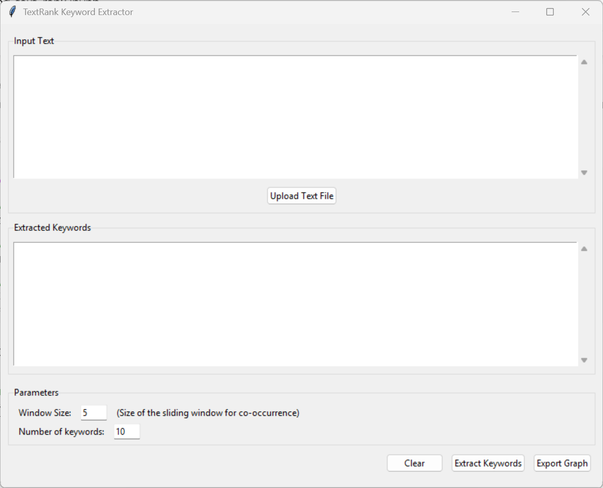

# TextRank Keyword Extraction

A Python library for extracting keywords from text using the TextRank algorithm. This implementation is based on the paper ["TextRank: Bringing Order into Texts"](https://web.eecs.umich.edu/~mihalcea/papers/mihalcea.emnlp04.pdf) by Rada Mihalcea and Paul Tarau.

## Installation

```bash
pip install git+https://github.com/alvaro-francisco-gil/text-rank.git
```

## Quick Start

Check out our interactive Jupyter notebook example to learn how to use the library:

[](https://colab.research.google.com/github/alvaro-francisco-gil/text-rank/blob/main/examples/using_text_rank.ipynb)

```python
from text_rank import TextRankKeywordExtractor

extractor = TextRankKeywordExtractor(window_size=5)

text = """
Natural language processing (NLP) is a subfield of linguistics, computer science, and artificial intelligence 
concerned with the interactions between computers and human language. It is used to apply algorithms to identify 
and extract the natural language rules such that unstructured language data is converted into a form that computers 
can understand.
"""

keywords = extractor.extract_keywords(text)
for word, score in keywords:
    print(f"{word}: {score:.4f}")
```

Example output:
```
language: 0.1190
computers: 0.0784
natural: 0.0774
science: 0.0560
computer: 0.0558
artificial: 0.0557
linguistics: 0.0555
intelligence: 0.0555
interactions: 0.0551
rules: 0.0548
unstructured: 0.0546
human: 0.0545
algorithms: 0.0543
subfield: 0.0495
processing: 0.0434
data: 0.0430
form: 0.0374
```

## Features

- Extract keywords from text using the TextRank algorithm
- Customizable window size for co-occurrence graph construction
- Configurable parts of speech (POS) tags for keyword extraction
- Export co-occurrence graphs to Pajek format for visualization
- Built-in stopword removal and text preprocessing
- Utility functions for file handling and batch processing

## Windows Application

A simple Windows application is available in the `app` directory that provides a graphical user interface for the TextRank keyword extraction functionality. The application allows you to:

- Upload text files or paste text directly
- Extract keywords with customizable number of results
- View keyword scores in a user-friendly interface



For more information, see the [App README](app/README.md).

## Contributing

Contributions are welcome! Please feel free to submit a Pull Request.

## License

This project is licensed under the MIT License - see the LICENSE file for details.
